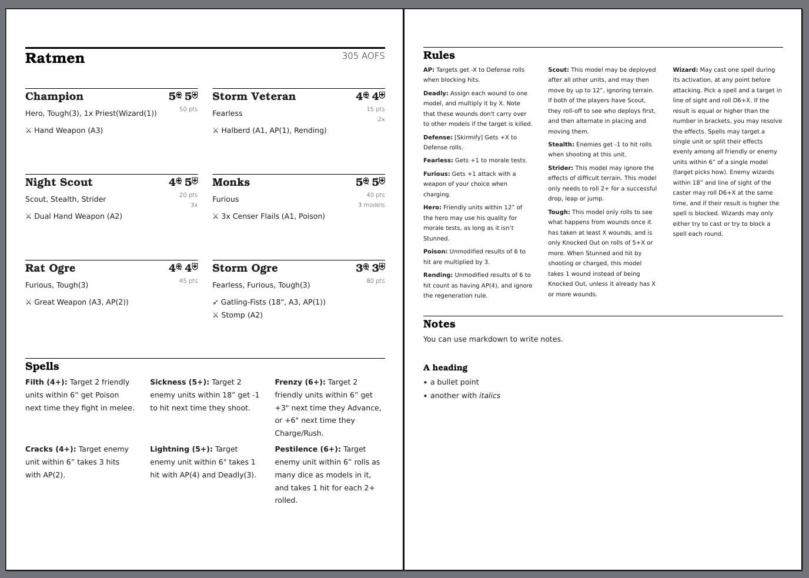

# text2tabletop

Generate prettier printouts of your [OnePageRules](https://army-forge.onepagerules.com/) armies.

Use it at [https://erkannt.github.io/text2tabletop/](https://erkannt.github.io/text2tabletop/)

## Development

Requires:

- [rust](https://rustup.rs/)
- [trunk](https://trunkrs.dev/)
- wasm target (`rustup target add wasm32-unknown-unknown`)

To run locally:
`trunk serve --open`
